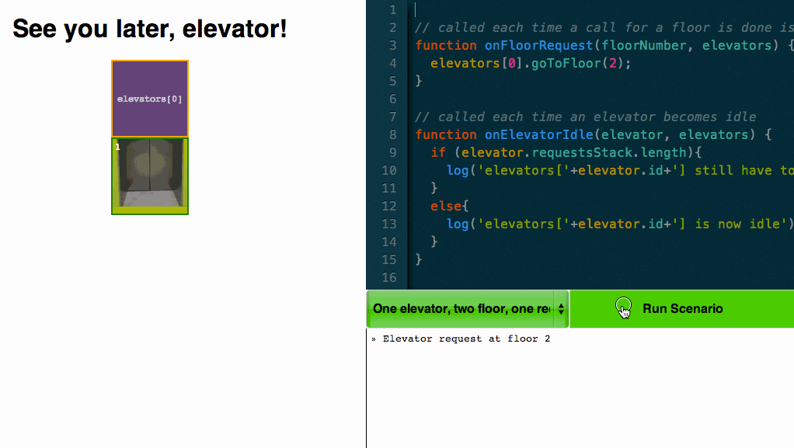

# See You Later Elevator

**See You Later Elevator** is a simple tool to question yourself about *programming* and *what is the mindset of programming*.

The only thing to do is to **orchestrate elevators**: sending them to a specific floor.

[](http://davidbruant.github.io/SeeYouLaterElevator/)

**See You Later Elevator** has been built by [David Bruant](https://twitter.com/DavidBruant) and [Thomas Parisot](https://oncletom.io) at [Mozilla Festival 2013](http://mozillafestival.org) in London.

# Goals

**See You Later Elevator** can help you achieving these goals by trial and error, and easy practicing in your browser:

- **learning the basics** of programming through real a real world example
- **challenging your brain** to improve your programming knowledge
- **picking up your curiosity** about how surrounding objects behave

*Cheating is allowed*. If you can **learn** something by cheating then this is valuable for you.

# Practicing Challenges

Challenges are ranked in a **progressive difficulty order**. You can start at level 7, no one will hate you for that.

> [Play **See You Later Elevator** challenges](http://davidbruant.github.io/SeeYouLaterElevator/)

## Handling Requests

> TBD.

## Handling Idle Times

> TBD.

# Getting Your Hands Dirty

## Install

If you don’t already have [Node.js](http://nodejs.org/) installed, install it through [nvm](https://github.com/creationix/nvm).

```bash
git clone https://github.com/DavidBruant/SeeYouLaterElevator.git
cd SeeYouLaterElevator
npm install
```

## Deploy on Github Pages

It will once requires you to install [grunt]() globally:

```bash
npm install -g grunt
```

Then perform:

```bash
grunt
```

# Roadmap

- sharing your IA online
- recording your own scenarii
- drag & drop interface

# License

```
This is free and unencumbered software released into the public domain.

Anyone is free to copy, modify, publish, use, compile, sell, or
distribute this software, either in source code form or as a compiled
binary, for any purpose, commercial or non-commercial, and by any
means.

In jurisdictions that recognize copyright laws, the author or authors
of this software dedicate any and all copyright interest in the
software to the public domain. We make this dedication for the benefit
of the public at large and to the detriment of our heirs and
successors. We intend this dedication to be an overt act of
relinquishment in perpetuity of all present and future rights to this
software under copyright law.

THE SOFTWARE IS PROVIDED "AS IS", WITHOUT WARRANTY OF ANY KIND,
EXPRESS OR IMPLIED, INCLUDING BUT NOT LIMITED TO THE WARRANTIES OF
MERCHANTABILITY, FITNESS FOR A PARTICULAR PURPOSE AND NONINFRINGEMENT.
IN NO EVENT SHALL THE AUTHORS BE LIABLE FOR ANY CLAIM, DAMAGES OR
OTHER LIABILITY, WHETHER IN AN ACTION OF CONTRACT, TORT OR OTHERWISE,
ARISING FROM, OUT OF OR IN CONNECTION WITH THE SOFTWARE OR THE USE OR
OTHER DEALINGS IN THE SOFTWARE.

For more information, please refer to <http://unlicense.org/>
```